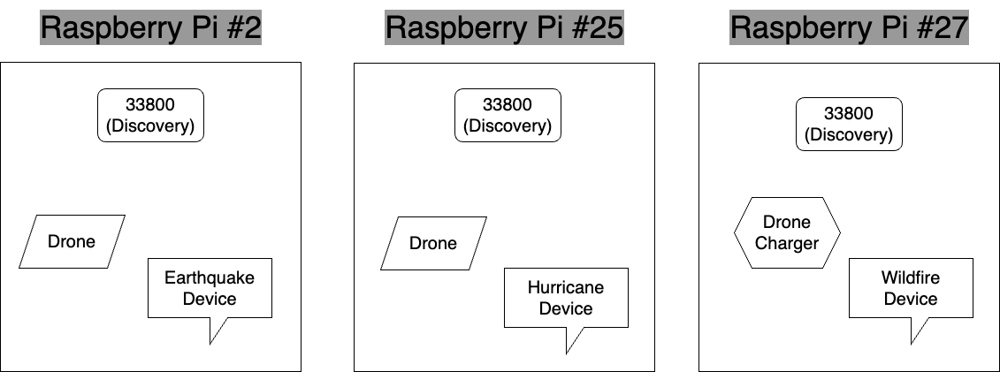
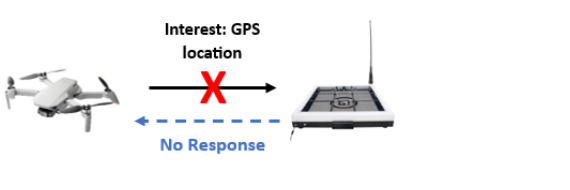
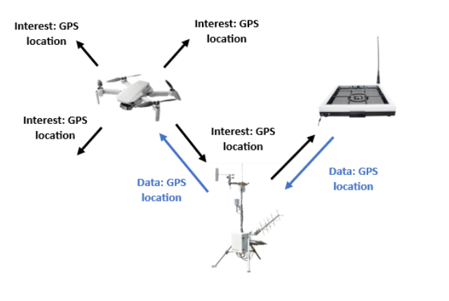

# Scalable ICN for Disaster-Management using Peer-to-Peer Communication

This project simulates a disaster management system using a scalable information centric network (ICN). Devices have 8 sensors/actuators that monitor readings for earthquakes, wildfires, and hurricanes. If these go over a threshold, they contact drones who assist the situation. Drones have a water payload, a general payload for first aid kits etc, speakers for preset information for the general public, and flashlights for visibilty. Drones decrease their battery over time, so they communicate with drone chargers to charge while carrying out tasks for devices monitoring the environment.

## Members of Group 2

|    Student Name    | Student ID |                Course                |      GitHub Username       |
|:------------------:|:----------:|:------------------------------------:|:--------------------------:|
|   Prathamesh Sai   |  19314123  | Integrated Computer Science (M.C.S.) |    [saisankp][saisankp]    |
|     Sean Dowling   |  to fill in  | Integrated Computer Engineering (M.A.I)      |    [seandownling123][seandownling123]      |
|     Hamzah Khan    |  23335427  | Computer Science - Data Science      |    [hamzah7k][hakhan]      |
|     Benika Yadav    |  to fill in  | Computer Science - Data Science      |    [beni444][beni444]      |

Code contributions by each member are noted in comments above each function.

# Setup
Everything should already be setup with the use of the virtual environment `env`, so you only need to activate this virtual environment. If anything goes wrong, choose commands from `setup.sh` to fix any issues.
```
source env/bin/activate
```

# Execution
There are multiple ways of running the code to see the value it brings. The Raspberry Pi's we used are provided to us by SCSS (School of Computer Science and Statistics) at Trinity College Dublin through a ssh connection from macneill. Beware that before running any .sh file, you may need to allow permissions to avoid the error "permission denied". You can do so by doing `chmod +x nameOfFile.sh`, followed by `./nameOfFile.sh` to run it.

## 1. Regular execution across various Raspberry Pi's
Here is a scenario that utilises all 5 devices our system uses (which have 8 sensors/actuators each) and shows how each device communicates with each other across multiple Raspberry Pi's. Port 33800 is used for the discovery stage (to let new devices know where other devices are and to let existing devices know when a new device enters the network).



You need 2 terminals open per Raspberry Pi. 

#### On Raspberry Pi #2 (Drone and Earthquake Device):

Terminal 1 (Drone): 
```
chmod +x demonstration/demo-1/pi-2/terminal-1.sh
./demonstration/demo-1/pi-2/terminal-1.sh
```

Terminal 2 (Earthquake Device): 
```
chmod +x demonstration/demo-1/pi-2/terminal-2.sh
./demonstration/demo-1/pi-2/terminal-2.sh
```

#### On Raspberry Pi #25 (Drone and Hurricane Device):

Terminal 1 (Drone): 
```
chmod +x demonstration/demo-1/pi-25/terminal-1.sh
./demonstration/demo-1/pi-25/terminal-1.sh
```

Terminal 2 (Hurricane Device): 
```
chmod +x demonstration/demo-1/pi-25/terminal-2.sh
./demonstration/demo-1/pi-25/terminal-2.sh
```

#### On Raspberry Pi #27 (Drone Charger and Earthquake Device):

Terminal 1 (Drone Charger): 
```
chmod +x demonstration/demo-1/pi-27/terminal-1.sh
./demonstration/demo-1/pi-27/terminal-1.sh
```

Terminal 2 (Wildfire Device): 
```
chmod +x demonstration/demo-1/pi-27/terminal-2.sh
./demonstration/demo-1/pi-27/terminal-2.sh
```

Make sure you run these scripts on their appropriate Raspberry Pi's. Using a different machine will cause issues since the commands used are catered to each Raspberry Pi.

## 2. View the robustness of our system
Drones in disaster scenarios are going to experience network issues. What happens if a drone loses connection with a drone charger all of a sudden? 



How will a drone know where to go if only a wildfire device is responsive? The answer is **flooding!** By flooding the network with the device's known devices and passing the requested information in the packet (in this case the GPS location), the wildfire device can communicate with the drone charger on behalf of the drone and give the response back. Now, the drone knows where to go!



You need 1 terminal open on the Raspberry Pi #2 and 2 terminals open on the Raspberry Pi #27

#### On Raspberry Pi #2 (Drone):

Terminal 1 (Drone): 
```
chmod +x demonstration/demo-2/pi-2/terminal-1.sh
./demonstration/demo-2/pi-2/terminal-1.sh
```

#### On Raspberry Pi #27 (Drone Charger and Wildfire Device):

Terminal 1 (Drone Charger): 
```
chmod +x demonstration/demo-2/pi-27/terminal-1.sh
./demonstration/demo-2/pi-27/terminal-1.sh
```

Terminal 2 (Wildfire Device): 
```
chmod +x demonstration/demo-2/pi-27/terminal-2.sh
./demonstration/demo-2/pi-27/terminal-2.sh
```

Make sure you run these scripts on their appropriate Raspberry Pi's. Using a different machine will cause issues, since we initialise the IP the device is running on initially in the commands.

## 3. Run all 5 devices per Raspberry Pi (OPTIONAL)
This is only optional if you are curious and want to experience some mayhem. It is hard to track everything going on, since there would be 5 devices x 3 Raspberry Pi's = 15 devices running in total. However, if you are curious you can run it to see how the system handles it.

You need 5 terminals open per Raspberry Pi.

#### On Raspberry Pi #2 (Drone, Drone Charger, Earthquake Device, Hurricane Device, Wildfire Device):

Terminal 1: 
```
chmod +x demonstration/demo-3/pi-2/terminal-1.sh
./demonstration/demo-3/pi-2/terminal-1.sh
```

Terminal 2: 
```
chmod +x demonstration/demo-3/pi-2/terminal-2.sh
./demonstration/demo-3/pi-2/terminal-2.sh
```

Terminal 3: 
```
chmod +x demonstration/demo-3/pi-2/terminal-3.sh
./demonstration/demo-3/pi-2/terminal-3.sh
```

Terminal 4: 
```
chmod demonstration/demo-3/pi-2/terminal-4.sh
./demonstration/demo-3/pi-2/terminal-4.sh
```

Terminal 5: 
```
chmod +x demonstration/demo-3/pi-2/terminal-5.sh
./demonstration/demo-3/pi-2/terminal-5.sh
```

#### On Raspberry Pi #25 (Drone, Drone Charger, Earthquake Device, Hurricane Device, Wildfire Device):

Terminal 1: 
```
chmod +x demonstration/demo-3/pi-25/terminal-1.sh
./demonstration/demo-3/pi-25/terminal-1.sh
```

Terminal 2: 
```
chmod +x demonstration/demo-3/pi-25/terminal-2.sh
./demonstration/demo-3/pi-25/terminal-2.sh
```

Terminal 3: 
```
chmod +x demonstration/demo-3/pi-25/terminal-3.sh
./demonstration/demo-3/pi-25/terminal-3.sh
```

Terminal 4: 
```
chmod +x demonstration/demo-3/pi-25/terminal-4.sh
./demonstration/demo-3/pi-25/terminal-4.sh
```

Terminal 5: 
```
chmod +x demonstration/demo-3/pi-25/terminal-5.sh
./demonstration/demo-3/pi-25/terminal-5.sh
```

#### On Raspberry Pi #27 (Drone, Drone Charger, Earthquake Device, Hurricane Device, Wildfire Device):

Terminal 1: 
```
chmod +x demonstration/demo-3/pi-27/terminal-1.sh
./demonstration/demo-3/pi-27/terminal-1.sh
```

Terminal 2: 
```
chmod +x demonstration/demo-3/pi-27/terminal-2.sh
./demonstration/demo-3/pi-27/terminal-2.sh
```

Terminal 3: 
```
chmod +x demonstration/demo-3/pi-27/terminal-3.sh
./demonstration/demo-3/pi-27/terminal-3.sh
```

Terminal 4: 
```
chmod +x demonstration/demo-3/pi-27/terminal-4.sh
./demonstration/demo-3/pi-27/terminal-4.sh
```

Terminal 5: 
```
chmod +x demonstration/demo-3/pi-27/terminal-5.sh
./demonstration/demo-3/pi-27/terminal-5.sh
```


# Demo
A few basic/interesting scenarios are recorded in the `/assets/demo` folder. Feel free to check them out below if you don't want to run everything but just want a quick overview of our project.
## Drone interacting with charger (when a drone has less than 35% battery)
https://github.com/saisankp/Scalable-P2P-Protocol/assets/34750736/220b6b16-af9b-46e0-b235-1e38b5e7a5e5

## Drone interacting with devices (when devices detect a disaster and contact drones)
https://github.com/saisankp/Scalable-P2P-Protocol/assets/34750736/d9a5484b-aa8f-4213-a552-4fcfc9c67384

## Proof of robustness in our system with flooding (using a special drone charger file that purposefully doesn't respond to mimic harsh environmental conditions)
https://github.com/saisankp/Scalable-P2P-Protocol/assets/34750736/7a8d11bd-56cf-4849-907b-a400a776106e

[saisankp]: https://github.com/saisankp
[seandownling123]: https://github.com/Seandowling123
[hakhan]: https://github.com/hamzah7k
[beni444]: https://github.com/beni444
